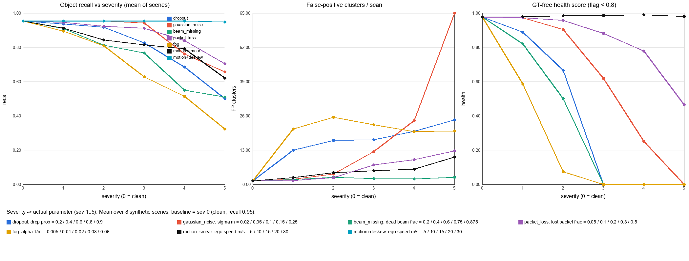

# T2 · LiDAR corruption benchmark: báo cáo 1 trang

**Nền tảng:** xe ADAS · **Tính năng:** phát hiện vật cản 3D (xe, người đi bộ) · **Sensor:** LiDAR quay 32 beam
**Metric:** object recall (proxy), FP cluster/scan, điểm/object theo khoảng cách, health score không cần GT
Chi tiết: [SOURCES.md](SOURCES.md) (Bước 2) · [DESIGN.md](DESIGN.md) (Bước 3) · `results/` (Bước 4)

| Mục | Nội dung |
|---|---|
| **Problem** | Perception 3D trên xe giả định point cloud sạch. Thực tế LiDAR gặp sương mù, beam chết, mất gói UDP, mất điểm, nhiễu và méo do xe chạy. Khi đó object biến mất hoặc ghost xuất hiện, và hệ thống thường **không biết** dữ liệu đang xấu. |
| **Method** | Nguồn chính: Dong et al., CVPR 2023 ([repo](https://github.com/thu-ml/3D_Corruptions_AD) @`48c23f7`). Input: point cloud N×4 + severity 1–5. Output: point cloud bị corrupt. Đo bằng AP/mAP/NDS và RCE trên KITTI-C/nuScenes-C/Waymo-C. Nhóm **không chạy được đường gốc** (cần dataset hàng trăm GB, MMDet3D, GPU), nên tự viết LiDAR ray-cast + corruption **theo tham số của repo** (fog α giống hệt; gaussian/density mở rộng thêm) + detector clustering cổ điển. **Giả định:** đường phẳng, object tĩnh, không có reflectance, detector không học. |
| **Benchmark** | Dữ liệu tổng hợp, 8 scene (seed 0–7), 171 GT object. 6 corruption × 5 mức + 1 cải tiến. Baseline: **recall 0.95 ± 0.06**, 1.3 FP/scan, health 0.98. Lệnh: `python run_benchmark.py`. |
| **Failure case** | Motion smear (không deskew) → recall giảm, health score **không** phát hiện. Xem bên dưới. |
| **Engineering decision** | Bắt buộc deskew, thêm health check động học, có fallback theo health. Xem bên dưới. |

## Kết quả (trung bình ± std qua 8 scene, `results/summary.csv`)

| Điều kiện | Mức nhẹ: recall | Mức nặng: recall | Khác | Health bắt được? |
|---|---|---|---|---|
| Baseline | 0.95 ± 0.06 | | 1.3 FP, 325 điểm/object ở 0–20 m | |
| Fog α (1/m) | 0.01 (MOR ~300 m): 0.81 ± 0.10 | 0.06 (MOR ~50 m): 0.32 ± 0.07 | α=0.02: recall 40–60 m = **0**; ~20–25 ghost FP/scan | ✅ near_clutter |
| Beam missing | 40%: 0.81 ± 0.14 | 87.5%: 0.51 ± **0.31** | Std lớn: kết quả phụ thuộc beam *nào* chết | ✅ beam/sector coverage |
| Gaussian σ | 0.10 m: 0.94 ± 0.07 | 0.25 m: 0.66 ± 0.06 | FP tăng **1.3 → 65/scan** | ✅ ground_flatness |
| Dropout | 60%: 0.83 ± 0.12 | 90%: 0.50 ± 0.06 | Mới 20% đã làm FP 1.3 → 13 | ✅ return rate |
| Packet loss | 30%: 0.84 ± 0.10 | 50%: 0.70 ± 0.06 | Mất trọn sector | ✅ sector coverage (≥ 30%) |
| **Motion smear** | 10 m/s: 0.84 ± 0.05 | 30 m/s: 0.62 ± 0.06 | Số điểm **không đổi** | ❌ **health ≈ 0.98** |
| **Motion + deskew** | 10 m/s: 0.95 | 30 m/s: 0.95 ± 0.06 | Về đúng mức baseline | không cần |

## Đối chiếu claim ở Bước 1 ([PLAN.md](PLAN.md))

| Claim | Kết quả đo | Kết luận |
|---|---|---|
| C1 · fog làm mất vùng xa trước | α=0.02: recall 0–20 m 0.75, 40–60 m **0.00**. Điểm/object ở 40–60 m từ 10.2 xuống 1.0 | Đúng |
| C2 · density giảm trước, recall giảm muộn hơn | Dropout 20%: object-point ratio 0.80 nhưng recall chỉ −1.8%. Phải tới 60% recall mới giảm 13% | Đúng |
| C3 · noise sinh ghost | σ=0.25 m: FP 1.3 → 65/scan | Đúng |
| C4 · motion: recall giảm, số điểm không đổi | 30 m/s: recall 0.62, object-point ratio 1.00, health 0.98 | Đúng |
| C5 · health flag trước khi recall giảm > 10% | Bắt được 5/6 loại, bỏ sót motion. Có false alarm ở mức nhẹ | Đúng một phần |

## Failure case: motion smear (Bước 5)

**Sensor gặp lỗi gì, ở mức nào?** Xe chạy 30 m/s (108 km/h), LiDAR quét 1 vòng trong 0.1 s, driver **không deskew**. Mỗi điểm lệch v·t, tối đa 3 m. Object nằm ở seam 0° (thẳng phía trước) bị xé làm hai mảnh.
Bằng chứng: `results/bev_before_after.png` (ô dưới phải) và hàng `motion_smear` trong `summary.csv`.

**Metric thay đổi ra sao?** Recall từ 0.95 → 0.84 (10 m/s) → 0.62 (30 m/s). FP từ 1.3 → 10.4/scan. Nhưng điểm/object, số điểm, beam coverage và sector coverage **giữ nguyên**, và health score vẫn 0.98 ± 0.03.

> **Nhóm quan sát được:** trong benchmark mô phỏng, motion smear không bù là corruption *duy nhất* làm recall của detector clustering giảm > 10% mà health score đếm điểm không flag ở mức nào (4/5 mức là `SILENT FAILURE`). Deskew bằng tốc độ odometry sai số 5% đưa recall về 0.95, tức bằng baseline.
>
> **Paper cho biết:** Dong et al. kết luận "motion-level corruptions are the most threatening". Moving Object gây khoảng 35% RCE, Motion Compensation cũng nằm trong nhóm gây hại mạnh. Corruption của họ là *nhiễu pose khi đã bù* (σ_t ≤ 0.10 m) trên detector học sâu, đo bằng AP/mAP. **Khác cơ chế, dataset và metric với bài của nhóm, nên không so sánh hai con số 35% với nhau.** Chỉ có chung một xu hướng: lỗi chuyển động gây hại nhiều.
>
> **Giả thuyết (chưa đo):** với detector học sâu (PointPillars, CenterPoint), object bị xé đôi có thể còn tệ hơn: hai box lệch nhau hoặc box sai heading, chứ không chỉ mất object. Với SLAM, smear có thể làm scan-matching lệch dần.

**Limitation của benchmark:**
- Dữ liệu tổng hợp, chỉ 8 scene. GT chia theo khoảng cách: 100 object ở 0–20 m, 56 ở 20–40 m, chỉ **15** ở 40–60 m (~2/scene), nên recall ở bin xa rất nhạy.
- Detector clustering chỉ là proxy, không phải mAP.
- Motion smear chỉ có chuyển động thẳng đều, không có quay hay gia tốc. Vì vậy deskew trong mô phỏng gần như *hoàn hảo*. Thực tế deskew còn sai do yaw rate, độ trễ timestamp và đồng bộ IMU.
- Health score được calibrate trên chính các scene clean này (8 scan), chưa kiểm tra trên scene khác.
- Chưa đo latency, chưa có mưa hoặc tuyết, chưa có object di động.

## Engineering decision

1. **Bắt buộc deskew** bằng IMU/odometry trước perception. *Kiểm chứng:* trong mô phỏng recall từ 0.62 về 0.95 ở 30 m/s. Vòng sau cần thêm sai số yaw rate và timestamp offset, rồi đo lại recall.
2. **Thêm health check động học**, vì đếm điểm không bắt được smear. Ví dụ: so ego-motion ước lượng từ scan-matching với odometry, theo dõi độ lệch timestamp giữa các gói và cờ "deskew applied" từ driver. *Kiểm chứng:* chạy lại benchmark, `motion_smear` phải đổi verdict từ `SILENT FAILURE` thành `caught`.
3. **Log cần có:** số điểm theo beam và sector, tỉ lệ điểm < 3 m, độ nhám mặt đất, packet drop counter, timestamp từng điểm. Đây là 5 thành phần của health score, rẻ và tính được realtime.
4. **Fallback:** health < 0.8 → giảm tốc độ tối đa, vì recall ở vùng > 40 m sụp trước tiên. Mất sector → coi vùng đó là *unknown*, không phải *free space*. Fog → tăng trọng số radar/camera trong fusion (Dong et al.: fusion bền hơn LiDAR-only).
5. **Data cần thêm:** fog thật (STF, MUSES), dữ liệu chạy nhanh có IMU, để xác nhận ngưỡng health 0.8 và các mức α/tốc độ.

**Trade-off:**
- Health score có *false alarm* ở mức nhẹ: dropout 40%, σ = 0.10 m và fog α = 0.005 bị flag dù recall mới giảm ≤ 6%. Riêng fog α = 0.005 làm FP tăng 1.3 → 21, nên flag sớm là hợp lý.
- **ADAS cao tốc:** deskew là bắt buộc, vì ở 30 m/s lệch tới 3 m.
- **Robot trong nhà** (< 1 m/s, lệch < 10 cm): có thể bỏ deskew. Nên ưu tiên dropout/beam health, vì kính bẩn và hỏng phần cứng là lỗi chính.
- **Drone:** quay nhanh nên cần deskew cả rotation. Mô hình hiện tại chưa cover trường hợp này.

## Tham khảo
[1] Y. Dong et al., *Benchmarking Robustness of 3D Object Detection to Common Corruptions in Autonomous Driving*, CVPR 2023, arXiv:2303.11040. Code: https://github.com/thu-ml/3D_Corruptions_AD (commit `48c23f77fe82`)
[2] L. Kong et al., *Robo3D: Towards Robust and Reliable 3D Perception against Corruptions*, ICCV 2023, arXiv:2303.17597. Code: https://github.com/worldbench/Robo3D (commit `481a3b8634b2`)
[3] M. Hahner et al., *Fog Simulation on Real LiDAR Point Clouds for 3D Object Detection in Adverse Weather*, ICCV 2021, arXiv:2108.05249

**Tái lập:** `pip install -r requirements.txt && python run_benchmark.py`. Seed cố định 0–7, Python 3.11.9, numpy 2.4.6, scipy 1.17.1, Pillow 12.3.0, chạy ~15 s trên CPU.
